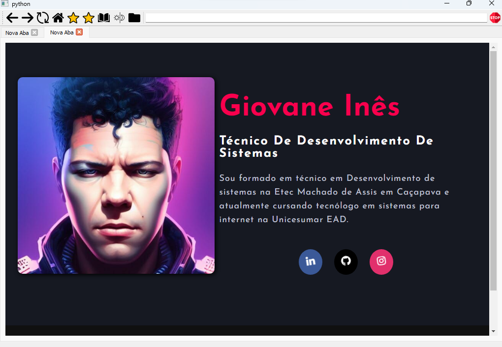
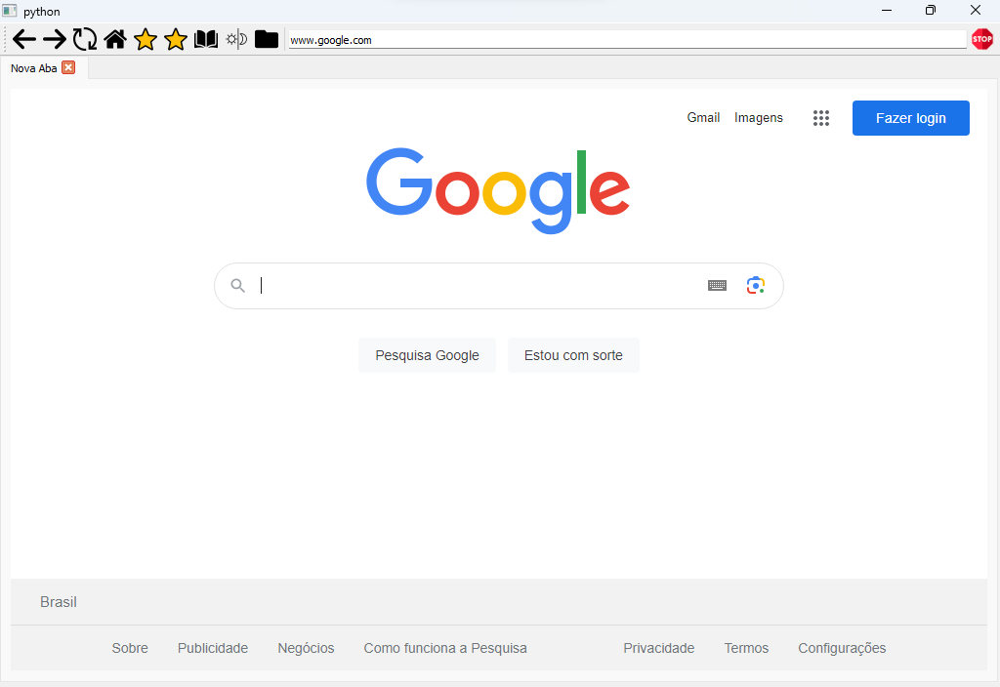

# VelocityBrowser

O **VelocityBrowser** é um navegador simples construído usando a biblioteca PyQt5. Ele oferece funcionalidades básicas de navegação na web, como abrir novas abas, navegar para frente e para trás, atualizar e parar a página atual, adicionar favoritos e visualizar o histórico de navegação.

## Instruções de Uso

### Instalação

Certifique-se de ter as seguintes bibliotecas Python instaladas:
- PyQt5
- PyQtWebEngine
- sqlite3

### Execução

Para executar o navegador, utilize o seguinte comando no terminal:

```bash
python nome_do_arquivo.py
```

## Funcionalidades

1. **Interface de Navegação**

    - **Back**: Volta para a página anterior.
    - **Forward**: Avança para a próxima página (após usar "Back").
    - **Reload**: Recarrega a página atual.
    - **Home**: Navega para a página inicial.
    - **Stop**: Para o carregamento da página atual.

2. **Gestão de Abas**

    - **Nova Aba (Ctrl+T)**: Abre uma nova aba.
    - **Fechar Aba (Ctrl+W)**: Fecha a aba atual.
    - **Mudar para a Próxima Aba (Ctrl+Tab)**: Alterna para a próxima aba.
    - **Mudar para a Aba Anterior (Ctrl+Shift+Tab)**: Alterna para a aba anterior.

3. **Favoritos**

    - **Favoritar**: Adiciona a página atual aos favoritos.

4. **Histórico**

    - **Histórico**: Exibe um histórico de páginas visitadas.

5. **Modo Noturno**

    - **Night Mode**: Alterna entre o modo noturno e o modo padrão.

6. **Personalização**

    - O navegador possui a capacidade de carregar uma folha de estilo personalizada. Para isso, basta substituir o arquivo `styles.css`.

## Capturas de Tela


*Legenda: Descrição da captura de tela 1.*


*Legenda: Descrição da captura de tela 2.*

## Estrutura do Código

O código consiste em três classes principais:

1. **AdBlocker** (subclass de QWebEnginePage): Esta classe implementa um bloqueador de anúncios simples.

2. **FavoritedItem** (subclass de QListWidgetItem): Esta classe representa um item na lista de favoritos.

3. **SimpleBrowser** (subclass de QMainWindow): Esta é a classe principal que define a interface do navegador e suas funcionalidades.

## Observações

- O navegador possui funcionalidades básicas de navegação e pode ser estendido com mais recursos conforme necessário.

- Certifique-se de ter os ícones necessários (por exemplo: `back_icon.png`, `forward_icon.png`, etc.) no mesmo diretório que o arquivo `.py`.

---

Para quaisquer dúvidas ou sugestões, por favor, sinta-se à vontade para entrar em contato.

**Aproveite a sua navegação com o VelocityBrowser!**
